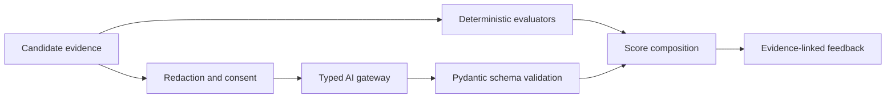

# AI Evaluation Architecture

Deterministic Python/SQL correctness is immutable input to composition. AI evaluates reasoning, communication, omissions, and trade-offs only within the configured rubric. Every output records prompt version, provider/model metadata, consent, token usage, retries, schema validation, evidence references, and confidence.

Scores contain overall and dimension values, strengths, critical weaknesses, missed requirements, incorrect assumptions, a better outline, study topics, next questions, readiness estimate, and confidence. Readiness is never an offer or compensation prediction.

The interview state machine is introduction, problem presentation, requirement discovery, candidate proposal, deep dive, constraint change, failure scenario, trade-off review, closing, and evaluation. Transitions and revealed facts are server-owned events, not an unrestricted prompt transcript.

