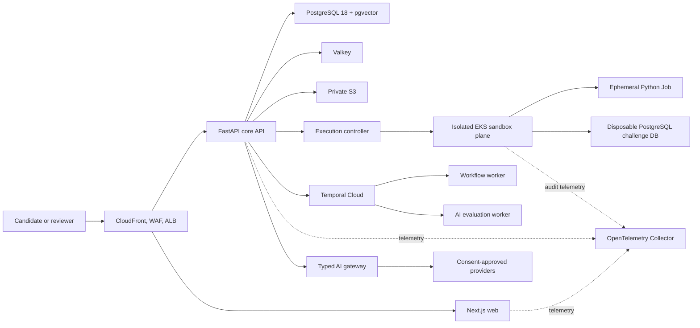

# System Architecture

## Selected approach

The core API is a FastAPI modular monolith deployed separately from the Next.js web application. Temporal workers handle durable work. An isolated EKS execution plane runs one gVisor-backed Kubernetes Job per untrusted submission. PostgreSQL is the system of record; Valkey is ephemeral; S3 stores large/binary artifacts.

## Trust boundaries

1. Public edge to application plane
2. Authenticated application plane to data services
3. Application plane to provider-controlled AI systems
4. Execution controller to deny-by-default sandbox plane
5. Tenant boundaries inside API, PostgreSQL RLS, and S3 object keys

The sandbox has no route to application databases, control-plane services, metadata endpoints, or the public internet.

## Source-of-truth matrix

| State | Authority |
| --- | --- |
| users, questions, submissions, scores, audits | PostgreSQL |
| platform-authored source content | reviewed Git revision |
| durable process state | Temporal |
| presence, rate limits, idempotency cache | Valkey with TTL |
| large artifacts and recordings | S3 |
| editor draft recovery | browser storage until server autosave succeeds |

Alternatives and detailed implications are recorded in ADR-001.

