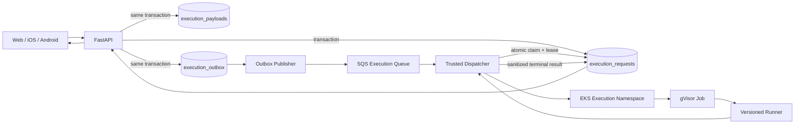

# Rigor Production Execution Plane

Status: implementation in progress; not staging-validated.



## Trust boundaries

### Trusted SaaS/control plane

- Next.js;
- FastAPI;
- PostgreSQL application data;
- Valkey;
- outbox publisher;
- execution dispatcher;
- expected test outputs and evaluation logic;
- result sanitizer and usage accounting.

### Untrusted execution plane

- candidate source;
- Python runner child process;
- SQL candidate statements;
- temporary candidate workspace;
- disposable SQL database state.

Candidate code must never execute in Web, FastAPI, a trusted worker, application RDS, or a mobile device.

## Durable request creation

The target async API persists all queue intent before returning `202 Accepted`:

```text
BEGIN
  INSERT execution_requests status=QUEUED
  INSERT execution_payloads
  INSERT execution_events status=QUEUED
  INSERT execution_outbox event=execution.requested
COMMIT
```

There is no independent `database.commit()` followed by an SQS send. The publisher later claims unpublished outbox rows using `FOR UPDATE SKIP LOCKED`.

## Queue semantics

The execution queue is a Standard SQS queue. Delivery is at least once.

Messages contain bounded metadata:

```json
{
  "schema_version": 1,
  "event_type": "execution.requested",
  "execution_id": "...",
  "attempt": 1,
  "requested_at": "...",
  "trace_id": "..."
}
```

Candidate source is not copied into SQS.

The Terraform module currently defines:

- KMS encryption;
- 20-second long polling;
- explicit visibility timeout;
- four-day normal retention;
- 14-day DLQ retention;
- redrive after bounded receive attempts;
- separate publisher, consumer and DLQ-operator IAM policy documents.

These resources are source implementation only until Terraform is applied in staging.

## Atomic claim and lease

The dispatcher does not trust queue uniqueness. It claims with compare-and-set semantics:

```sql
UPDATE execution_requests
SET state='DISPATCHING',
    lease_owner=:worker_id,
    lease_expires_at=:lease_expires_at,
    attempt_count=attempt_count + 1
WHERE id=:execution_id
  AND state='QUEUED'
RETURNING ...;
```

Zero returned rows means the delivery must not launch another sandbox. Leases may be renewed only by the current owner while unexpired. Expired lease discovery is implemented; recovery decisions still require the reconciler to inspect Kubernetes state before any retry.

## Sandbox creation

Python Jobs are generated from server-controlled profiles. Candidate input cannot choose arbitrary CPU, memory, storage, timeout, RuntimeClass, service account, or image.

Required Job properties now encoded in source:

- `runtimeClassName: gvisor`;
- dedicated `candidate-execution` service account;
- service-account token automount disabled;
- no host network/PID/IPC;
- restricted pod security;
- seccomp RuntimeDefault;
- non-root UID/GID;
- read-only root filesystem;
- no privilege escalation;
- all Linux capabilities dropped;
- bounded CPU, memory and ephemeral storage;
- no retry by Kubernetes (`backoffLimit: 0`);
- active deadline and TTL;
- default-deny ingress and egress.

## Python runner contract

Expected answers never enter the candidate container. The trusted plane supplies candidate source plus test inputs only. The runner executes each test in a child interpreter, applies process/file/fd limits, bounds output, suppresses hidden-test stdout/stderr, and returns actual values for trusted comparison after the sandbox finishes.

The Python language restrictions are defense in depth, not the isolation boundary. gVisor, Kubernetes resource controls and network isolation remain mandatory.

## Still missing for end-to-end production execution

1. Async Run/Submit API wiring and status/cancel routes.
2. Concrete SQS transport and consumer service.
3. Dedicated trusted execution-worker database identity/policies.
4. Full dispatcher lifecycle and idempotent Kubernetes resource adapter.
5. Result collection, trusted expected-output comparison, sanitizer and terminal persistence.
6. Reconciliation/cancellation cleanup.
7. Disposable PostgreSQL SQL runner.
8. EKS node infrastructure and actual `runsc` staging proof.
9. S3 execution artifacts/scoped access.
10. Metrics, alerts, DLQ operations and load/failure testing.

Production readiness must not advance substantially until the end-to-end staging path succeeds through SQS → dispatcher → EKS → gVisor.
