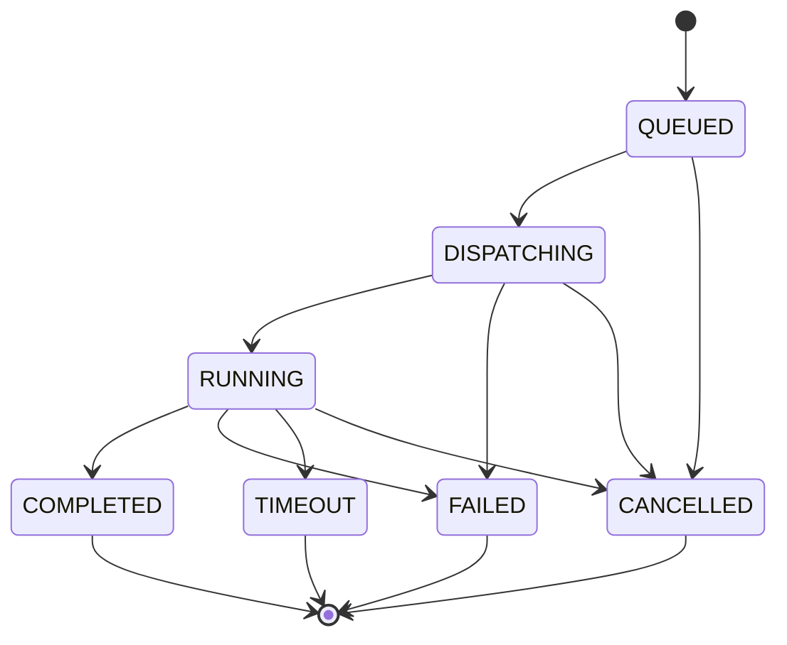

# Execution State Machine

The production execution lifecycle is deliberately independent from candidate result semantics such as individual test pass/fail. An execution may complete successfully even when candidate tests fail.



## Rules

- `QUEUED` means the execution and its outbox event have committed durably.
- `DISPATCHING` means one trusted dispatcher owns a bounded lease and is creating or locating the sandbox Job.
- `RUNNING` means the sandbox has started execution.
- `COMPLETED`, `FAILED`, `TIMEOUT`, and `CANCELLED` are terminal.
- Terminal executions never transition back to a non-terminal state.
- Duplicate queue delivery does not create a second execution or bypass the state check.
- Expired leases are handled by reconciliation after checking the Kubernetes Job identity; an expired lease alone is not permission to rerun code blindly.

## Compatibility

Earlier schema versions used `PASSED`, `ERROR`, and `TIMED_OUT` in the shared PostgreSQL `execution_state` enum. Those values remain temporarily because `submission_results` still uses that enum. The execution aggregate normalizes legacy values as:

```text
PASSED    -> COMPLETED
ERROR     -> FAILED
TIMED_OUT -> TIMEOUT
```

New production execution orchestration must use the canonical lifecycle above. Candidate correctness belongs in sanitized result/evaluation data rather than the infrastructure lifecycle.

## Transaction boundary

Creation is one database transaction:

```text
INSERT execution_requests (QUEUED)
INSERT execution_payloads
INSERT execution_events (QUEUED)
INSERT execution_outbox (execution.requested)
COMMIT
```

The SQS send is intentionally outside that transaction. A trusted publisher later claims unpublished outbox rows with concurrency-safe locking:

```sql
SELECT ...
FROM execution_outbox
WHERE published_at IS NULL
  AND next_attempt_at <= CURRENT_TIMESTAMP
ORDER BY created_at, id
FOR UPDATE SKIP LOCKED
LIMIT :limit;
```

Publishing retries use capped exponential backoff with jitter. The queue event contains execution identity and bounded metadata only; candidate source is not copied into SQS.

## Idempotency

The existing candidate-scoped uniqueness constraint remains the first serialization boundary. New execution creation also records a request fingerprint derived from execution type, session, question version, runtime, and source. Reuse of one idempotency key for a different request fails instead of silently returning an unrelated execution.

API wiring must scope client keys by endpoint, for example `run:<client-key>` and `submit:<client-key>`.
